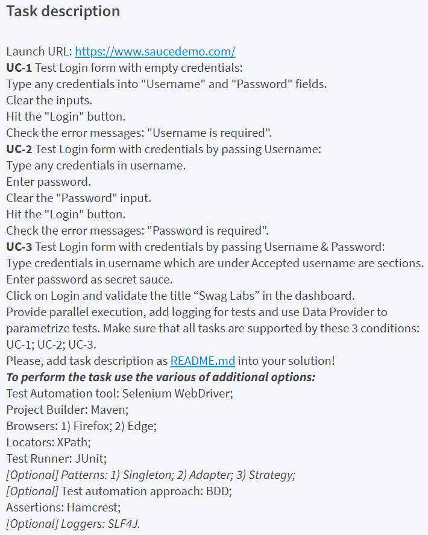

Automated UI tests using Selenium Web Driver  
https://saucedemo.com

Supported browsers:  Firefox, Edge

Browser environment by default is set to Firefox. 
To run the default test suite with **Firefox** Driver run mvn clean test

To run the tests with Edge browser: 
**mvn clean test -Dbrowser=Edge** 
or  
**mvn test -Dbrowser=Edge**

